# FreeIPA

Solution centralisée IAM - Centralise l'authentification, l'autorisation et la gestion des identités pour l'ensemble du SI.

FreeIPA est une brique d'infrastructure de cybersécurité destinée à centraliser, sécuriser et contrôler les identités, les accès et les authentifications dans les environnements Linux, tout en s'intégrant à Active Directory.

## Fonctionnalités

- **Gestion des identités** - Stocke et administre les utilisateurs, groupes, hôtes et politiques de sécurité.
- **Single Sign-On (SSO) via Kerberos** - Permet un accès transparent aux services après une seule authentification.
- **Autorité de certification intégrée (CA)** - Délivre des certificats X.509 pour renforcer l'authentification et sécuriser les échanges.
- **Service DNS intégré (BIND)** - Gère les noms de machines et les enregistrements DNS nécessaires au bon fonctionnement du domaine.
- **389 Directory Server** - Sert de backend LDAP pour le stockage et la cohérence des données d'identité.
- **Interface d'administration web** - Offre une gestion centralisée et accessible via un navigateur.
- **Interopérabilité avec Active Directory** - S'intègre à un domaine AD via une relation d'approbation pour partager l'authentification Kerberos.

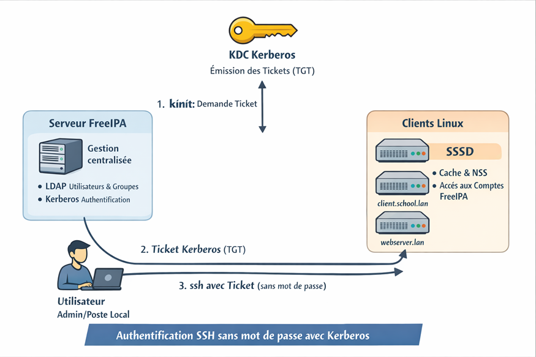

## Authentification centralisée

Au lieu que chaque serveur garde ses propres comptes et mots de passe, FreeIPA joue le rôle de serveur d'identité central.

Les machines et services authentifient l'utilisateur via IPA / Kerberos / LDAP.

### Schéma conceptuel simple

```
Utilisateur
    │
    ▼
[ Kerberos / LDAP / FreeIPA ]
    │
    ├─ SSH sur serveur A
    ├─ SSH sur serveur B
    ├─ NFS sécurisé
    └─ Applications IPA
```

- L'utilisateur se connecte avec le même login et mot de passe partout
- Le serveur IPA délivre un ticket Kerberos (kinit) pour prouver son identité
- Les services confirment le ticket et laissent passer → SSO (Single Sign-On)

## POC avec 2 VMs

- **1 Fedora** - serveur FreeIPA
- **1 Debian** - client FreeIPA

**Objectif** : montrer que FreeIPA centralise l'authentification sur un client Linux

**Réseau** : NAT VMware (identique pour les 2)
- IP : stables
- DNS : assuré par FreeIPA

### 1) Préparation réseau & nommage

| Machine | Hostname | IP |
|---------|----------|-----|
| Serveur | ipa.school.lan | 192.168.239.10 |
| Client | client.school.lan | 192.168.239.20 |

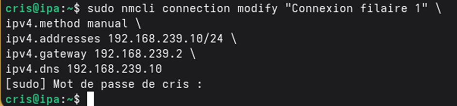

**Sur Fedora ET Debian**

```bash
sudo hostnamectl set-hostname <hostname>
```

**/etc/hosts sur les 2 machines**

```
192.168.239.10 ipa.school.lan ipa
192.168.239.20 client.school.lan client
```

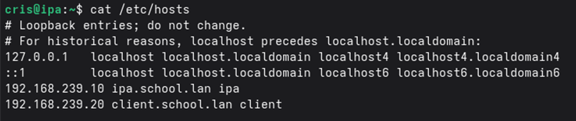

**Pourquoi ?**
- Kerberos repose sur le DNS
- FreeIPA crée les enregistrements automatiquement

### 2) Installation du serveur FreeIPA (Fedora)

**Paquets**

```bash
sudo dnf install -y freeipa-server freeipa-server-dns
```

**Installation**

```bash
sudo ipa-server-install
```

**Réponses importantes :**
- Domaine DNS : `school.lan`
- Realm Kerberos : `SCHOOL.LAN`
- DNS intégré : **oui**
- Forwarder DNS : `8.8.8.8`

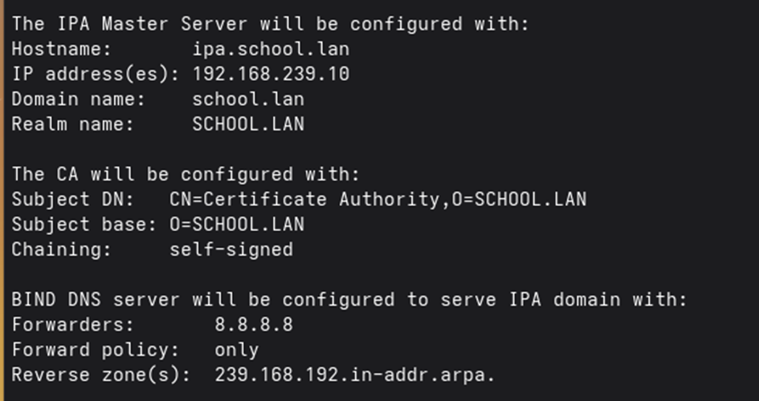

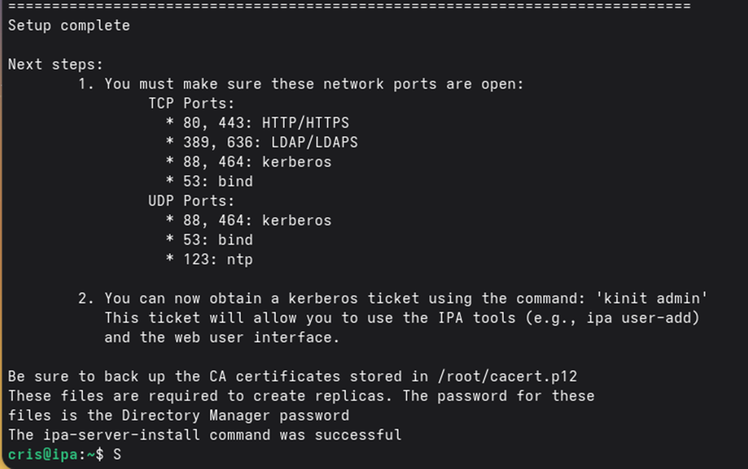

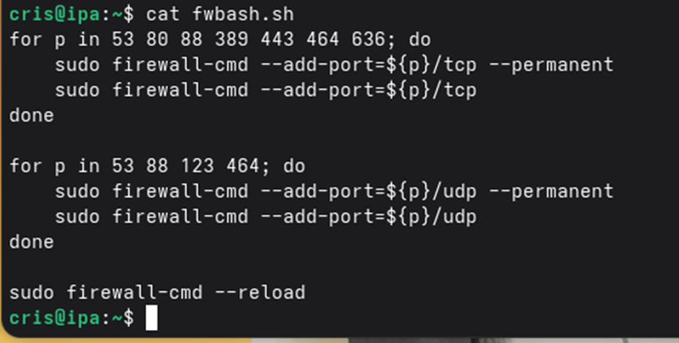

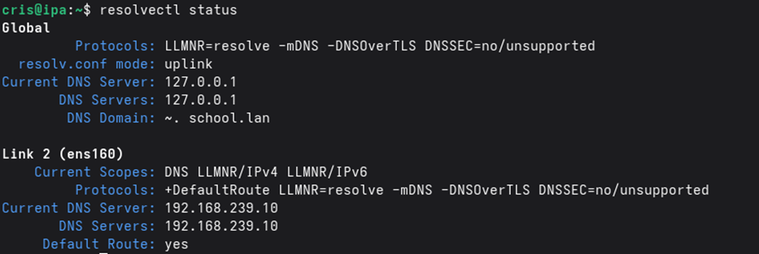

### 3) Vérifications serveur

```bash
kinit admin  # permet d'obtenir un ticket d'authentification Kerberos pour un utilisateur
klist        # permet de voir les tickets Kerberos actuellement en cache pour ton utilisateur
```

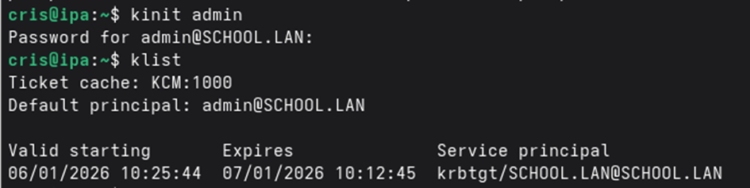

```bash
ipa user-find  # chercher des utilisateurs dans le serveur IPA
```

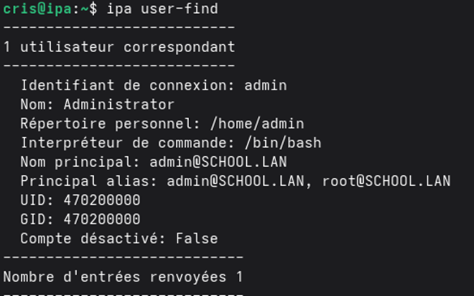

```bash
ipa host-find  # chercher des hôtes enregistrés dans le serveur IPA
```

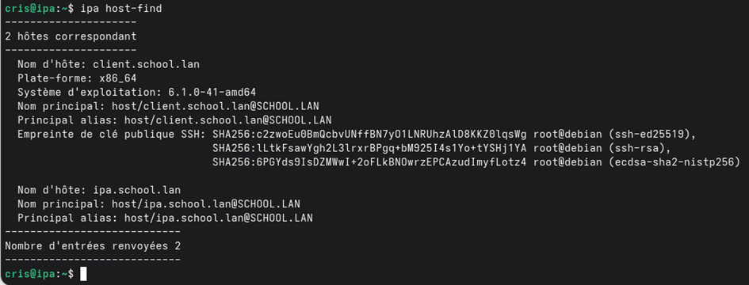

**Interface web :**

https://ipa.school.lan

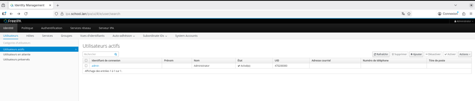

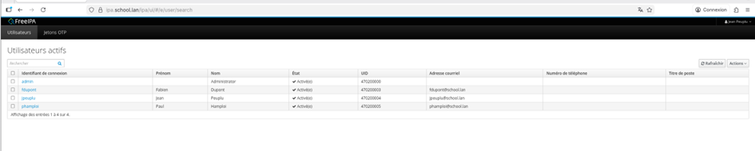

### 4) Création d'un utilisateur (serveur)

```bash
ipa user-add phamploi --first 'Paul' --last 'Hamploi' --shell=/bin/bash --home=/home/phamploi --password
```

- UID/GID automatiques
- Compte stocké dans LDAP
- Authentification via Kerberos

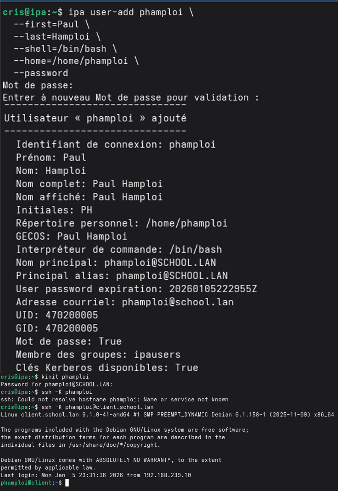

### 5) Configuration du client Debian

**Paquets nécessaires**

```bash
sudo apt update
sudo apt install -y freeipa-client sssd krb5-user
```

**Lors de l'installation de krb5-user :**
- Realm par défaut : `SCHOOL.LAN`

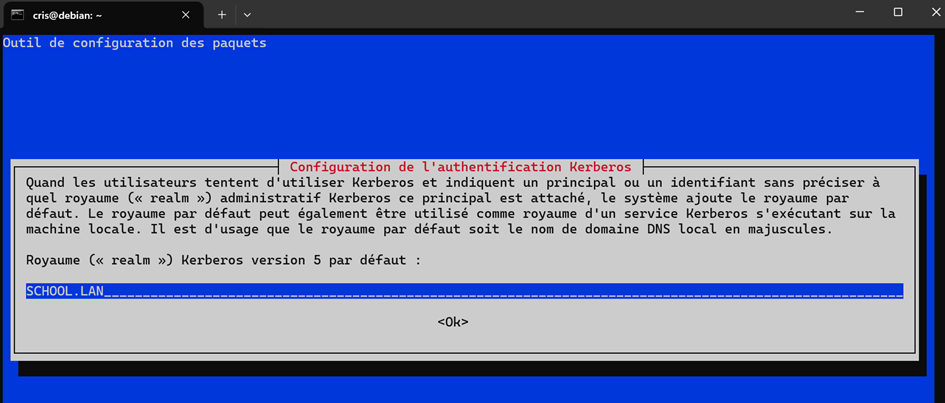

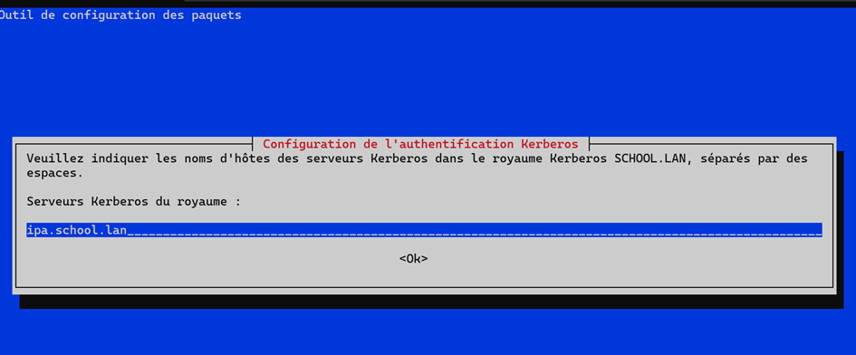

**Jonction au domaine**

```bash
sudo ipa-client-install --mkhomedir
```

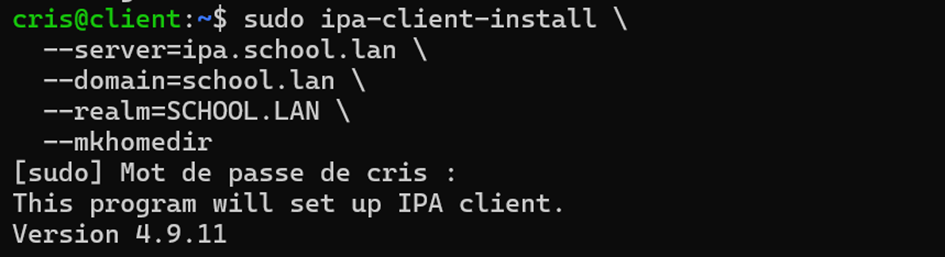

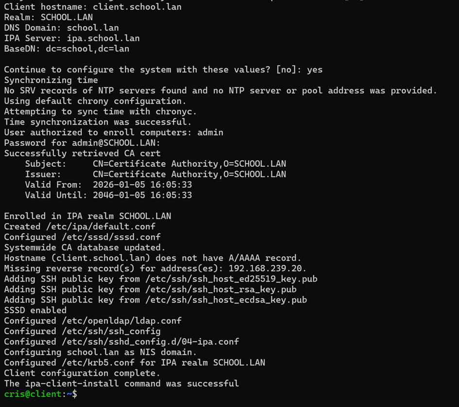

**Configuration SSH**

Ouvre `/etc/ssh/sshd_config` sur **le client** et assure-toi que ces lignes sont présentes :

```
KerberosAuthentication yes
GSSAPIAuthentication yes
GSSAPICleanupCredentials yes
```

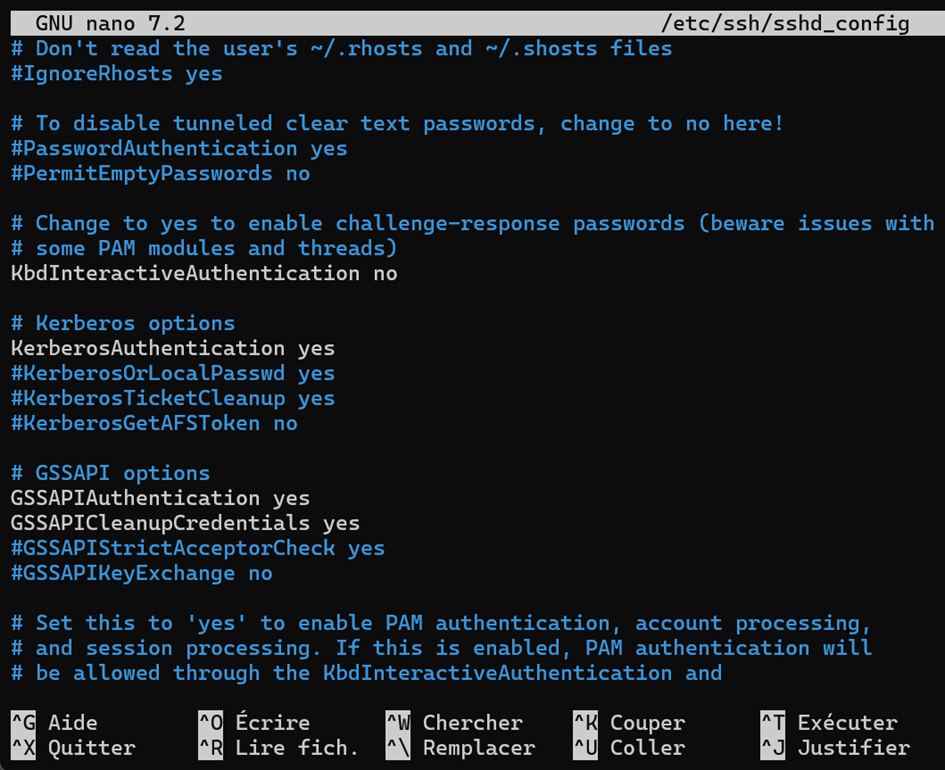

### 6) Tests côté client

**Vérifier l'utilisateur**

```bash
getent passwd phamploi
```


**Connexion**

```bash
su - phamploi
```

**Vérifier Kerberos**

```bash
klist
```

**Résultat attendu :**
- Pas de compte local
- Connexion centralisée
- Ticket Kerberos actif

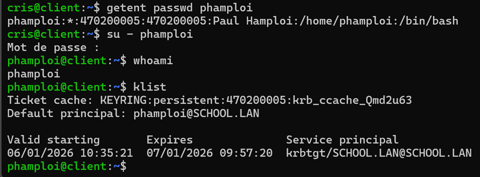